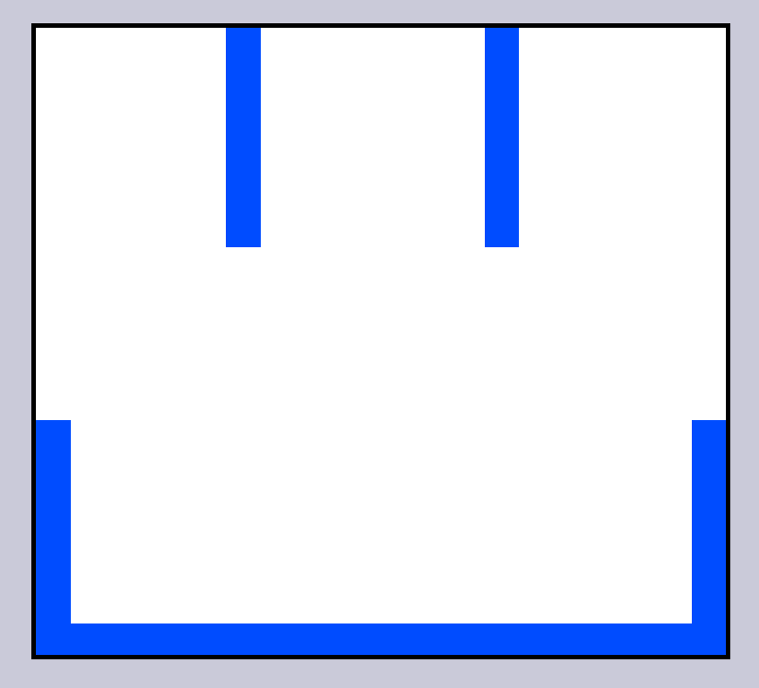

# Sketch Pad
<!-- PROJECT LOGO -->
 

   

  

    <strong>A Sketch Pad</strong>
     
    <a href="https://mohammad-afsari.github.io/etch_a_sketch/">View Demo</a>
    ·
    <a href="https://mohammad-afsari.github.io/etch_a_sketch//issues">Report Bug</a>
    ·
    <a href="https://mohammad-afsari.github.io/etch_a_sketch//issues">Request Feature</a>
  

<!-- ABOUT THE PROJECT -->
## About The Project

A simple sketch-pad

### Built With
<ul>
   <li>HTML</li>
   <li>CSS</li> 
   <li>Vanilla JavaScript</li> 
   <ul>
      <li>DOM Manipulation</li>
      </ul>
</ul>
